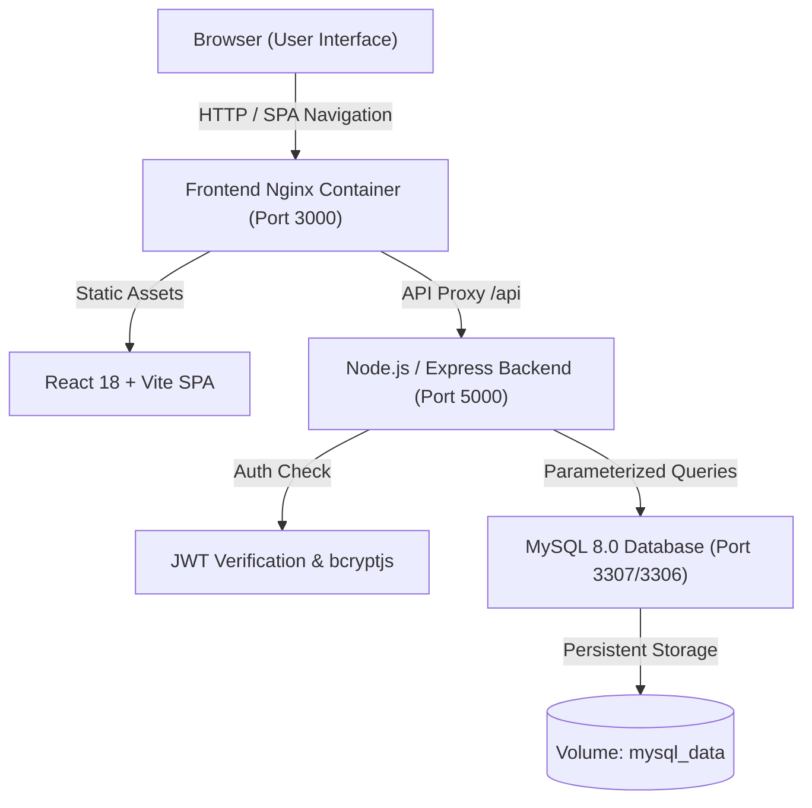
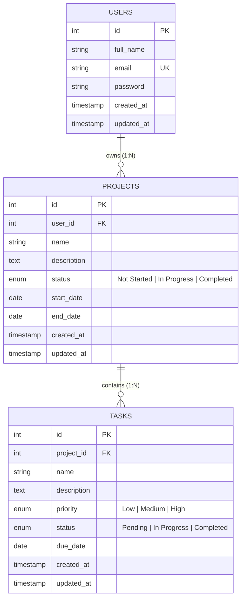

# Full-Stack Project Management System

A production-grade, secure, containerized Full-Stack Project Management System built with **React 18 (Vite)**, **Node.js (Express)**, and **MySQL 8.0**. 

Designed with strict data ownership isolation, parameterized SQL security, comprehensive input validation, glassmorphic UI aesthetics, 100% automated test coverage across 123 test scenarios, and complete Docker Compose orchestration.

---

## Architecture Overview

### System Architecture


### Entity-Relationship Diagram (ERD)


---

## Tech Stack

* **Frontend**: React 18, Vite, Vanilla CSS (Glassmorphic Theme), Lucide Icons, Axios.
* **Backend**: Node.js (ES Modules), Express.js, `mysql2/promise` Connection Pool, `jsonwebtoken`, `bcryptjs`, `express-rate-limit`.
* **Database**: MySQL 8.0 with InnoDB engine, foreign keys (`ON DELETE CASCADE`), and query performance indexes.
* **DevOps & Security**: Docker, Docker Compose, Multi-stage Nginx container, Parameterized queries (`pool.execute`), Strict input validation, Mass-assignment whitelisting.

---

## Key Features

1. **User Authentication & Privacy**:
   * User Registration, Login, Logout with JWT Bearer tokens and `bcryptjs` password hashing (salt 10).
   * Rate limiting (`authRateLimiter`) on authentication routes preventing brute-force attacks.
2. **Project Management (CRUD)**:
   * Create, View, Edit, and Delete projects with complete ownership isolation (`WHERE user_id = req.user.id`).
   * Validated fields: Name, Description, Status (`Not Started`, `In Progress`, `Completed`), Start Date, End Date (`end_date >= start_date`).
3. **Task Management (CRUD)**:
   * Create, Edit, Delete, and Mark tasks completed under owned projects (`tasks JOIN projects ON tasks.project_id = projects.id WHERE projects.user_id = req.user.id`).
   * Validated fields: Name, Description, Priority (`Low`, `Medium`, `High`), Status (`Pending`, `In Progress`, `Completed`), Due Date, `project_id`.
   * Automatic cascade deletion on project removal.
4. **Glassmorphic Metric Dashboard**:
   * Real-time aggregated user analytics (`totalProjects`, `totalTasks`, `completedTasks`, `pendingTasks`, `projectsInProgress`).
5. **Search & Multi-Criteria Filtering**:
   * Live search by name and filtering by status, priority, and project across project and task views.
6. **Security & Validation Review**:
   * 100% Parameterized queries (`?` binding) protecting against SQL injection.
   * Mass assignment whitelisting preventing `user_id` or `id` body injection.
   * Cross-user data isolation returning `404 Not Found` to prevent resource existence leaking.

---

## Getting Started

### Prerequisites
* [Node.js v18+](https://nodejs.org/)
* [MySQL 8.0 Server](https://www.mysql.com/) (For local non-Docker dev)
* [Docker & Docker Compose](https://www.docker.com/) (For containerized deployment)

---

### Option A: Running with Docker Compose (Recommended)

1. **Clone the repository**:
   ```bash
   git clone <repository_url>
   cd project-management-system
   ```

2. **Configure Environment Variables**:
   Copy `.env.example` to `.env`:
   ```bash
   cp .env.example .env
   ```
   *Note: `.env` is ignored by Git to preserve secret privacy.*

3. **Start Containers**:
   ```bash
   docker compose up -d
   ```
   * Access **Frontend UI**: `http://localhost:3000`
   * Access **Backend API**: `http://localhost:5000/api`
   * Access **MySQL DB**: `localhost:3307`

4. **Stop Containers**:
   ```bash
   docker compose down
   ```

---

### Option B: Local Development (Without Docker)

1. **Initialize MySQL Database**:
   Import `backend/db/init.sql` into your MySQL instance:
   ```bash
   mysql -u root -p < backend/db/init.sql
   ```

2. **Backend Setup**:
   ```bash
   cd backend
   cp .env.example .env
   # Edit backend/.env with your MySQL credentials and JWT secret
   npm install
   npm run dev
   ```
   Backend runs on `http://localhost:5000`.

3. **Frontend Setup**:
   ```bash
   cd frontend
   cp .env.example .env
   npm install
   npm run dev
   ```
   Frontend runs on `http://localhost:3000`.

---

## API Documentation Reference

| Method | Endpoint | Access | Description |
| :--- | :--- | :--- | :--- |
| **GET** | `/api/health` | Public | API and Database Health Check |
| **POST** | `/api/auth/register` | Public | Register new user account |
| **POST** | `/api/auth/login` | Public | Authenticate user & return JWT |
| **POST** | `/api/auth/logout` | Protected | Logout user session |
| **GET** | `/api/projects` | Protected | List owned projects (Supports `?search=` & `?status=`) |
| **GET** | `/api/projects/:id` | Protected | Get details for owned project |
| **POST** | `/api/projects` | Protected | Create new project |
| **PUT** | `/api/projects/:id` | Protected | Update owned project |
| **DELETE** | `/api/projects/:id` | Protected | Delete owned project and its tasks |
| **GET** | `/api/tasks` | Protected | List tasks (Supports `?search=`, `?status=`, `?priority=`, `?project_id=`) |
| **GET** | `/api/tasks/:id` | Protected | Get task details |
| **POST** | `/api/tasks` | Protected | Create new task under owned project |
| **PUT** | `/api/tasks/:id` | Protected | Update owned task |
| **DELETE** | `/api/tasks/:id` | Protected | Delete owned task |
| **GET** | `/api/dashboard` | Protected | Get aggregated metric statistics |

---

## Testing & Quality Verification

Run the automated backend test suites:
```bash
cd backend
node test_auth.js
node test_projects.js
node test_tasks.js
node test_dashboard.js
node test_search_filters.js
node test_security.js
```

Verify frontend production build:
```bash
cd frontend
npm run build
```

See [TESTING.md](./TESTING.md) for full test metrics, scenario details, and verification results (123 / 123 tests passing).
